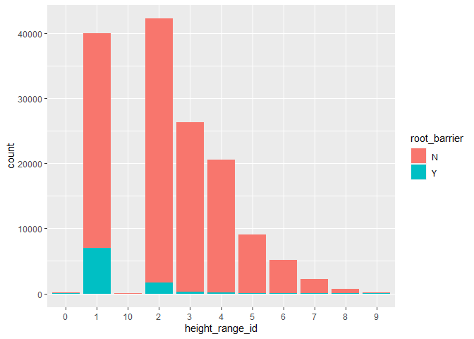

Mini Data Analysis Milestone 2
================

*To complete this milestone, you can edit [this `.rmd`
file](https://raw.githubusercontent.com/UBC-STAT/stat545.stat.ubc.ca/master/content/mini-project/mini-project-2.Rmd)
directly. Fill in the sections that are commented out with
`<!--- start your work here--->`. When you are done, make sure to knit
to an `.md` file by changing the output in the YAML header to
`github_document`, before submitting a tagged release on canvas.*

# Welcome to your second (and last) milestone in your mini data analysis project!

In Milestone 1, you explored your data, came up with research questions,
and obtained some results by making summary tables and graphs. This
time, we will first explore more in depth the concept of *tidy data.*
Then, you’ll be sharpening some of the results you obtained from your
previous milestone by:

- Manipulating special data types in R: factors and/or dates and times.
- Fitting a model object to your data, and extract a result.
- Reading and writing data as separate files.

**NOTE**: The main purpose of the mini data analysis is to integrate
what you learn in class in an analysis. Although each milestone provides
a framework for you to conduct your analysis, it’s possible that you
might find the instructions too rigid for your data set. If this is the
case, you may deviate from the instructions – just make sure you’re
demonstrating a wide range of tools and techniques taught in this class.

# Instructions

**To complete this milestone**, edit [this very `.Rmd`
file](https://raw.githubusercontent.com/UBC-STAT/stat545.stat.ubc.ca/master/content/mini-project/mini-project-2.Rmd)
directly. Fill in the sections that are tagged with
`<!--- start your work here--->`.

**To submit this milestone**, make sure to knit this `.Rmd` file to an
`.md` file by changing the YAML output settings from
`output: html_document` to `output: github_document`. Commit and push
all of your work to your mini-analysis GitHub repository, and tag a
release on GitHub. Then, submit a link to your tagged release on canvas.

**Points**: This milestone is worth 55 points (compared to the 45 points
of the Milestone 1): 45 for your analysis, and 10 for your entire
mini-analysis GitHub repository. Details follow.

**Research Questions**: In Milestone 1, you chose two research questions
to focus on. Wherever realistic, your work in this milestone should
relate to these research questions whenever we ask for justification
behind your work. In the case that some tasks in this milestone don’t
align well with one of your research questions, feel free to discuss
your results in the context of a different research question.

# Learning Objectives

By the end of this milestone, you should:

- Understand what *tidy* data is, and how to create it using `tidyr`.
- Generate a reproducible and clear report using R Markdown.
- Manipulating special data types in R: factors and/or dates and times.
- Fitting a model object to your data, and extract a result.
- Reading and writing data as separate files.

# Setup

Begin by loading your data and the tidyverse package below:

``` r
library(datateachr) # <- might contain the data you picked!
library(tidyverse)
library(here)
```

# Task 1: Tidy your data (15 points)

In this task, we will do several exercises to reshape our data. The goal
here is to understand how to do this reshaping with the `tidyr` package.

A reminder of the definition of *tidy* data:

- Each row is an **observation**
- Each column is a **variable**
- Each cell is a **value**

*Tidy’ing* data is sometimes necessary because it can simplify
computation. Other times it can be nice to organize data so that it can
be easier to understand when read manually.

### 2.1 (2.5 points)

Based on the definition above, can you identify if your data is tidy or
untidy? Go through all your columns, or if you have \>8 variables, just
pick 8, and explain whether the data is untidy or tidy.

<!--------------------------- Start your work below --------------------------->

``` r
glimpse(vancouver_trees)
```

    ## Rows: 146,611
    ## Columns: 20
    ## $ tree_id            <dbl> 149556, 149563, 149579, 149590, 149604, 149616, 149…
    ## $ civic_number       <dbl> 494, 450, 4994, 858, 5032, 585, 4909, 4925, 4969, 7…
    ## $ std_street         <chr> "W 58TH AV", "W 58TH AV", "WINDSOR ST", "E 39TH AV"…
    ## $ genus_name         <chr> "ULMUS", "ZELKOVA", "STYRAX", "FRAXINUS", "ACER", "…
    ## $ species_name       <chr> "AMERICANA", "SERRATA", "JAPONICA", "AMERICANA", "C…
    ## $ cultivar_name      <chr> "BRANDON", NA, NA, "AUTUMN APPLAUSE", NA, "CHANTICL…
    ## $ common_name        <chr> "BRANDON ELM", "JAPANESE ZELKOVA", "JAPANESE SNOWBE…
    ## $ assigned           <chr> "N", "N", "N", "Y", "N", "N", "N", "N", "N", "N", "…
    ## $ root_barrier       <chr> "N", "N", "N", "N", "N", "N", "N", "N", "N", "N", "…
    ## $ plant_area         <chr> "N", "N", "4", "4", "4", "B", "6", "6", "3", "3", "…
    ## $ on_street_block    <dbl> 400, 400, 4900, 800, 5000, 500, 4900, 4900, 4900, 7…
    ## $ on_street          <chr> "W 58TH AV", "W 58TH AV", "WINDSOR ST", "E 39TH AV"…
    ## $ neighbourhood_name <chr> "MARPOLE", "MARPOLE", "KENSINGTON-CEDAR COTTAGE", "…
    ## $ street_side_name   <chr> "EVEN", "EVEN", "EVEN", "EVEN", "EVEN", "ODD", "ODD…
    ## $ height_range_id    <dbl> 2, 4, 3, 4, 2, 2, 3, 3, 2, 2, 2, 5, 3, 2, 2, 2, 2, …
    ## $ diameter           <dbl> 10.00, 10.00, 4.00, 18.00, 9.00, 5.00, 15.00, 14.00…
    ## $ curb               <chr> "N", "N", "Y", "Y", "Y", "Y", "Y", "Y", "Y", "Y", "…
    ## $ date_planted       <date> 1999-01-13, 1996-05-31, 1993-11-22, 1996-04-29, 19…
    ## $ longitude          <dbl> -123.1161, -123.1147, -123.0846, -123.0870, -123.08…
    ## $ latitude           <dbl> 49.21776, 49.21776, 49.23938, 49.23469, 49.23894, 4…

I think my data is untidy because there are some columns that should be
united.

- `civic_number` and `std_street`:

- `on_street_block` and `on_street`:

- `longitude` and `latitude`:

<!----------------------------------------------------------------------------->

### 2.2 (5 points)

Now, if your data is tidy, untidy it! Then, tidy it back to it’s
original state.

If your data is untidy, then tidy it! Then, untidy it back to it’s
original state.

Be sure to explain your reasoning for this task. Show us the “before”
and “after”.

<!--------------------------- Start your work below --------------------------->

**Dataset before modification:**

``` r
glimpse(vancouver_trees)
```

    ## Rows: 146,611
    ## Columns: 20
    ## $ tree_id            <dbl> 149556, 149563, 149579, 149590, 149604, 149616, 149…
    ## $ civic_number       <dbl> 494, 450, 4994, 858, 5032, 585, 4909, 4925, 4969, 7…
    ## $ std_street         <chr> "W 58TH AV", "W 58TH AV", "WINDSOR ST", "E 39TH AV"…
    ## $ genus_name         <chr> "ULMUS", "ZELKOVA", "STYRAX", "FRAXINUS", "ACER", "…
    ## $ species_name       <chr> "AMERICANA", "SERRATA", "JAPONICA", "AMERICANA", "C…
    ## $ cultivar_name      <chr> "BRANDON", NA, NA, "AUTUMN APPLAUSE", NA, "CHANTICL…
    ## $ common_name        <chr> "BRANDON ELM", "JAPANESE ZELKOVA", "JAPANESE SNOWBE…
    ## $ assigned           <chr> "N", "N", "N", "Y", "N", "N", "N", "N", "N", "N", "…
    ## $ root_barrier       <chr> "N", "N", "N", "N", "N", "N", "N", "N", "N", "N", "…
    ## $ plant_area         <chr> "N", "N", "4", "4", "4", "B", "6", "6", "3", "3", "…
    ## $ on_street_block    <dbl> 400, 400, 4900, 800, 5000, 500, 4900, 4900, 4900, 7…
    ## $ on_street          <chr> "W 58TH AV", "W 58TH AV", "WINDSOR ST", "E 39TH AV"…
    ## $ neighbourhood_name <chr> "MARPOLE", "MARPOLE", "KENSINGTON-CEDAR COTTAGE", "…
    ## $ street_side_name   <chr> "EVEN", "EVEN", "EVEN", "EVEN", "EVEN", "ODD", "ODD…
    ## $ height_range_id    <dbl> 2, 4, 3, 4, 2, 2, 3, 3, 2, 2, 2, 5, 3, 2, 2, 2, 2, …
    ## $ diameter           <dbl> 10.00, 10.00, 4.00, 18.00, 9.00, 5.00, 15.00, 14.00…
    ## $ curb               <chr> "N", "N", "Y", "Y", "Y", "Y", "Y", "Y", "Y", "Y", "…
    ## $ date_planted       <date> 1999-01-13, 1996-05-31, 1993-11-22, 1996-04-29, 19…
    ## $ longitude          <dbl> -123.1161, -123.1147, -123.0846, -123.0870, -123.08…
    ## $ latitude           <dbl> 49.21776, 49.21776, 49.23938, 49.23469, 49.23894, 4…

**Operations for tidying the data:**

``` r
# Combine civic_number and std_street to associated_address
vancouver_trees <- vancouver_trees %>%
  unite(col = associated_address, c(civic_number, std_street), sep = " - ")


# Combine on_street_block and on_street to physical_address
vancouver_trees <- vancouver_trees %>%
  unite(col = physical_address, c(on_street_block, on_street), sep = " - ")


# Combine longitude and latitude to coordinates
vancouver_trees <- vancouver_trees %>%
  unite(col = coordinates, c(longitude, latitude), sep = ",")
```

**Dataset after modification:**

``` r
glimpse(vancouver_trees)
```

    ## Rows: 146,611
    ## Columns: 17
    ## $ tree_id            <dbl> 149556, 149563, 149579, 149590, 149604, 149616, 149…
    ## $ associated_address <chr> "494 - W 58TH AV", "450 - W 58TH AV", "4994 - WINDS…
    ## $ genus_name         <chr> "ULMUS", "ZELKOVA", "STYRAX", "FRAXINUS", "ACER", "…
    ## $ species_name       <chr> "AMERICANA", "SERRATA", "JAPONICA", "AMERICANA", "C…
    ## $ cultivar_name      <chr> "BRANDON", NA, NA, "AUTUMN APPLAUSE", NA, "CHANTICL…
    ## $ common_name        <chr> "BRANDON ELM", "JAPANESE ZELKOVA", "JAPANESE SNOWBE…
    ## $ assigned           <chr> "N", "N", "N", "Y", "N", "N", "N", "N", "N", "N", "…
    ## $ root_barrier       <chr> "N", "N", "N", "N", "N", "N", "N", "N", "N", "N", "…
    ## $ plant_area         <chr> "N", "N", "4", "4", "4", "B", "6", "6", "3", "3", "…
    ## $ physical_address   <chr> "400 - W 58TH AV", "400 - W 58TH AV", "4900 - WINDS…
    ## $ neighbourhood_name <chr> "MARPOLE", "MARPOLE", "KENSINGTON-CEDAR COTTAGE", "…
    ## $ street_side_name   <chr> "EVEN", "EVEN", "EVEN", "EVEN", "EVEN", "ODD", "ODD…
    ## $ height_range_id    <dbl> 2, 4, 3, 4, 2, 2, 3, 3, 2, 2, 2, 5, 3, 2, 2, 2, 2, …
    ## $ diameter           <dbl> 10.00, 10.00, 4.00, 18.00, 9.00, 5.00, 15.00, 14.00…
    ## $ curb               <chr> "N", "N", "Y", "Y", "Y", "Y", "Y", "Y", "Y", "Y", "…
    ## $ date_planted       <date> 1999-01-13, 1996-05-31, 1993-11-22, 1996-04-29, 19…
    ## $ coordinates        <chr> "-123.116113,49.217763", "-123.114718,49.217759", "…

**Operations for untidying it back:**

``` r
vancouver_trees <- vancouver_trees %>%
  separate(col = associated_address, c("civic_number", "std_street"), sep = " - ")


vancouver_trees <- vancouver_trees %>%
  separate(col = physical_address, c("on_street_block", "on_street"), sep = " - ")


vancouver_trees <- vancouver_trees %>%
  separate(col = coordinates, c("longitude", "latitude"), sep = ",")


vancouver_trees$civic_number <- as.numeric(vancouver_trees$civic_number)
vancouver_trees$on_street_block <- as.numeric(vancouver_trees$on_street_block)
vancouver_trees$longitude <- as.numeric(vancouver_trees$longitude)
vancouver_trees$latitude <- as.numeric(vancouver_trees$latitude)
```

**Dataset after untidying back:**

``` r
glimpse(vancouver_trees)
```

    ## Rows: 146,611
    ## Columns: 20
    ## $ tree_id            <dbl> 149556, 149563, 149579, 149590, 149604, 149616, 149…
    ## $ civic_number       <dbl> 494, 450, 4994, 858, 5032, 585, 4909, 4925, 4969, 7…
    ## $ std_street         <chr> "W 58TH AV", "W 58TH AV", "WINDSOR ST", "E 39TH AV"…
    ## $ genus_name         <chr> "ULMUS", "ZELKOVA", "STYRAX", "FRAXINUS", "ACER", "…
    ## $ species_name       <chr> "AMERICANA", "SERRATA", "JAPONICA", "AMERICANA", "C…
    ## $ cultivar_name      <chr> "BRANDON", NA, NA, "AUTUMN APPLAUSE", NA, "CHANTICL…
    ## $ common_name        <chr> "BRANDON ELM", "JAPANESE ZELKOVA", "JAPANESE SNOWBE…
    ## $ assigned           <chr> "N", "N", "N", "Y", "N", "N", "N", "N", "N", "N", "…
    ## $ root_barrier       <chr> "N", "N", "N", "N", "N", "N", "N", "N", "N", "N", "…
    ## $ plant_area         <chr> "N", "N", "4", "4", "4", "B", "6", "6", "3", "3", "…
    ## $ on_street_block    <dbl> 400, 400, 4900, 800, 5000, 500, 4900, 4900, 4900, 7…
    ## $ on_street          <chr> "W 58TH AV", "W 58TH AV", "WINDSOR ST", "E 39TH AV"…
    ## $ neighbourhood_name <chr> "MARPOLE", "MARPOLE", "KENSINGTON-CEDAR COTTAGE", "…
    ## $ street_side_name   <chr> "EVEN", "EVEN", "EVEN", "EVEN", "EVEN", "ODD", "ODD…
    ## $ height_range_id    <dbl> 2, 4, 3, 4, 2, 2, 3, 3, 2, 2, 2, 5, 3, 2, 2, 2, 2, …
    ## $ diameter           <dbl> 10.00, 10.00, 4.00, 18.00, 9.00, 5.00, 15.00, 14.00…
    ## $ curb               <chr> "N", "N", "Y", "Y", "Y", "Y", "Y", "Y", "Y", "Y", "…
    ## $ date_planted       <date> 1999-01-13, 1996-05-31, 1993-11-22, 1996-04-29, 19…
    ## $ longitude          <dbl> -123.1161, -123.1147, -123.0846, -123.0870, -123.08…
    ## $ latitude           <dbl> 49.21776, 49.21776, 49.23938, 49.23469, 49.23894, 4…

<!----------------------------------------------------------------------------->

### 2.3 (7.5 points)

Now, you should be more familiar with your data, and also have made
progress in answering your research questions. Based on your interest,
and your analyses, pick 2 of the 4 research questions to continue your
analysis in the next four tasks:

<!-------------------------- Start your work below ---------------------------->

1.  *Is root barrier affecting the diameter of trees? Is there any
    relationship between root_barrier, and tree genus/species?*
2.  *What is the relationship between tree diameter and date_plant? Is
    it possible to predict tree diameter based on the variables like
    date_plant, genus, species?*

<!----------------------------------------------------------------------------->

Explain your decision for choosing the above two research questions.

<!--------------------------- Start your work below --------------------------->

I found above two research questions are more interesting to explore and
more related to our course content. The second research question
Milestone 1 has been solved in. The fourth question should be solved by
applying clustering algorithm, which does not relate to this course
content.

<!----------------------------------------------------------------------------->

Now, try to choose a version of your data that you think will be
appropriate to answer these 2 questions. Use between 4 and 8 functions
that we’ve covered so far (i.e. by filtering, cleaning, tidy’ing,
dropping irrelevant columns, etc.).

<!--------------------------- Start your work below --------------------------->

**Research question 1:**

> Is root barrier affecting the diameter of trees? Is there any
> relationship between root_barrier, and tree genus/species?

First, I only keep `genus_name`, `root_barrier`, `diameter` columns and
drop the others.

``` r
genus_root_barrier_diameter_vancouver_trees <- vancouver_trees %>%
  select(genus_name, root_barrier, diameter)

genus_root_barrier_diameter_vancouver_trees
```

    ## # A tibble: 146,611 × 3
    ##    genus_name root_barrier diameter
    ##    <chr>      <chr>           <dbl>
    ##  1 ULMUS      N                10  
    ##  2 ZELKOVA    N                10  
    ##  3 STYRAX     N                 4  
    ##  4 FRAXINUS   N                18  
    ##  5 ACER       N                 9  
    ##  6 PYRUS      N                 5  
    ##  7 ACER       N                15  
    ##  8 ACER       N                14  
    ##  9 ACER       N                16  
    ## 10 FRAXINUS   N                 7.5
    ## # … with 146,601 more rows

Then filter all `root_barrier == 'Y'` samples to calculate the number of
root_barrier-installed trees for each genus.

``` r
number_of_root_barrier <- genus_root_barrier_diameter_vancouver_trees %>%
  filter(root_barrier == 'Y') %>%
  group_by(genus_name) %>%
  count() %>%
  arrange(desc(n)) 

number_of_root_barrier
```

    ## # A tibble: 45 × 2
    ## # Groups:   genus_name [45]
    ##    genus_name     n
    ##    <chr>      <int>
    ##  1 ACER        3109
    ##  2 PRUNUS       898
    ##  3 CARPINUS     664
    ##  4 FRAXINUS     546
    ##  5 FAGUS        473
    ##  6 PYRUS        414
    ##  7 CRATAEGUS    403
    ##  8 PARROTIA     368
    ##  9 SORBUS       362
    ## 10 SYRINGA      253
    ## # … with 35 more rows

Next, `pivot_wider` is used to tidy data and compare the mean diameter
of root_barrier-installed trees with the uninstalled ones for each
genus.

``` r
mean_diameter_root_barrier <- genus_root_barrier_diameter_vancouver_trees %>%
  group_by(root_barrier, genus_name) %>%
  summarise(Mean = mean(diameter)) %>%
  pivot_wider(names_from = root_barrier, values_from = Mean)
```

    ## `summarise()` has grouped output by 'root_barrier'. You can override using the
    ## `.groups` argument.

``` r
mean_diameter_root_barrier
```

    ## # A tibble: 97 × 3
    ##    genus_name      N     Y
    ##    <chr>       <dbl> <dbl>
    ##  1 ABIES       13.0   3   
    ##  2 ACER        11.2   4.64
    ##  3 AESCULUS    23.9   9.31
    ##  4 AILANTHUS   15.9  NA   
    ##  5 ALBIZIA      6    NA   
    ##  6 ALNUS       17.5  NA   
    ##  7 AMELANCHIER  3.22  2.5 
    ##  8 ARALIA       6.81 NA   
    ##  9 ARAUCARIA   11.4  NA   
    ## 10 ARBUTUS     18.4  NA   
    ## # … with 87 more rows

Then, I try to find out the genus with a larger mean diameter for
root_barrier-installed trees.

``` r
mean_diameter_root_barrier %>%
  filter(Y > N)
```

    ## # A tibble: 6 × 3
    ##   genus_name        N     Y
    ##   <chr>         <dbl> <dbl>
    ## 1 CERCIS         3.38  4.06
    ## 2 CHAMAECYPARIS 17.9  19   
    ## 3 METASEQUOIA   12.9  17.8 
    ## 4 PARROTIA       4.00  4.09
    ## 5 PICEA         11.0  16.3 
    ## 6 THUJA         17.5  38

We can see that there are 6 genus with a longer mean diameter for
root_barrier-installed trees. I try to find the potential reason by
looking into `number_of_root_barrier` data.

``` r
number_of_root_barrier %>%
  filter(genus_name %in% c("CERCIS", "CHAMAECYPARIS", "METASEQUOIA", "PARROTIA", "PICEA", "THUJA"))
```

    ## # A tibble: 6 × 2
    ## # Groups:   genus_name [6]
    ##   genus_name        n
    ##   <chr>         <int>
    ## 1 PARROTIA        368
    ## 2 CERCIS           40
    ## 3 METASEQUOIA       6
    ## 4 PICEA             3
    ## 5 CHAMAECYPARIS     1
    ## 6 THUJA             1

Genus “METASEQUOIA”, “PICEA”, “CHAMAECYPARIS”, “THUJA” have a longer
mean diameter because there are few observations for them, while
“PARROTIA” and “CERCIS” should be special cases.

**Research question 2:**

> What is the relationship between tree diameter and date_plant? Is it
> possible to predict tree diameter based on the variables like
> date_plant, genus, species?

Not only date_plant, the other colmuns like tree genus, species, or
cultivar may also impact the tree diameter. I try to explore the tree
diameter statistics under different tree genus, species, or cultivar.

First, I only keep `genus`, `species`, `cultivar`, `diameter` columns
and drop the others.

``` r
genus_species_cultivar_diameter_vancouver_trees <- vancouver_trees %>%
  select(genus_name, species_name, cultivar_name, diameter)

genus_species_cultivar_diameter_vancouver_trees
```

    ## # A tibble: 146,611 × 4
    ##    genus_name species_name cultivar_name   diameter
    ##    <chr>      <chr>        <chr>              <dbl>
    ##  1 ULMUS      AMERICANA    BRANDON             10  
    ##  2 ZELKOVA    SERRATA      <NA>                10  
    ##  3 STYRAX     JAPONICA     <NA>                 4  
    ##  4 FRAXINUS   AMERICANA    AUTUMN APPLAUSE     18  
    ##  5 ACER       CAMPESTRE    <NA>                 9  
    ##  6 PYRUS      CALLERYANA   CHANTICLEER          5  
    ##  7 ACER       PLATANOIDES  COLUMNARE           15  
    ##  8 ACER       PLATANOIDES  COLUMNARE           14  
    ##  9 ACER       PLATANOIDES  COLUMNARE           16  
    ## 10 FRAXINUS   AMERICANA    AUTUMN APPLAUSE      7.5
    ## # … with 146,601 more rows

``` r
genus_species_cultivar_diameter_vancouver_trees %>%
  group_by(genus_name) %>%
  summarise(max(diameter), min(diameter), mean(diameter))
```

    ## # A tibble: 97 × 4
    ##    genus_name  `max(diameter)` `min(diameter)` `mean(diameter)`
    ##    <chr>                 <dbl>           <dbl>            <dbl>
    ##  1 ABIES                  42.5               1            12.9 
    ##  2 ACER                  317                 0            10.6 
    ##  3 AESCULUS               64                 0            23.7 
    ##  4 AILANTHUS              21.5               3            15.9 
    ##  5 ALBIZIA                 6                 6             6   
    ##  6 ALNUS                  40                 0            17.5 
    ##  7 AMELANCHIER            20                 0             3.21
    ##  8 ARALIA                 12                 3             6.81
    ##  9 ARAUCARIA              32                 3            11.4 
    ## 10 ARBUTUS                33                 6            18.4 
    ## # … with 87 more rows

``` r
genus_species_cultivar_diameter_vancouver_trees %>%
  group_by(species_name) %>%
  summarise(max(diameter), min(diameter), mean(diameter))
```

    ## # A tibble: 283 × 4
    ##    species_name   `max(diameter)` `min(diameter)` `mean(diameter)`
    ##    <chr>                    <dbl>           <dbl>            <dbl>
    ##  1 ABIES                     35               2              12.9 
    ##  2 ACERIFOLIA   X            57               2              20.8 
    ##  3 ACUMINATA                 28               2              10.9 
    ##  4 ACUTISSIMA                36               2               8.87
    ##  5 AILANTHIFOLIA             40              24              32   
    ##  6 ALBA                      40               1.5            19.4 
    ##  7 ALBA-SINENSIS             10               7               8.67
    ##  8 ALNIFOLIA                 20.2             2               5.23
    ##  9 ALPINUM                    8               8               8   
    ## 10 ALTISSIMA                 21.5             3              15.9 
    ## # … with 273 more rows

``` r
genus_species_cultivar_diameter_vancouver_trees %>%
  group_by(cultivar_name) %>%
  summarise(max(diameter), min(diameter), mean(diameter))
```

    ## # A tibble: 294 × 4
    ##    cultivar_name   `max(diameter)` `min(diameter)` `mean(diameter)`
    ##    <chr>                     <dbl>           <dbl>            <dbl>
    ##  1 ACCOLADE                   42              3               20.8 
    ##  2 AKEBONO                    66              0                7.76
    ##  3 ALIA                        5.5            5                5.33
    ##  4 ALLGOLD                    11.5            2                3.81
    ##  5 ALMIRA                     29              5               17.4 
    ##  6 AMANOGAWA                  26              3                8.52
    ##  7 AMERICAN BEAUTY             6              4                5.33
    ##  8 APOLLO                      3              3                3   
    ##  9 ARIE PETERS                30              0                3.98
    ## 10 ARISTOCRAT                 12              0.75             4.92
    ## # … with 284 more rows

From the above statistics, we can see that the diameters under different
genus, species, cultivar also differs a lot. Therefore, We can predict
specific tree diameter based on the data in same genus, species,
cultivar.

<!----------------------------------------------------------------------------->

# Task 2: Special Data Types (10)

For this exercise, you’ll be choosing two of the three tasks below –
both tasks that you choose are worth 5 points each.

But first, tasks 1 and 2 below ask you to modify a plot you made in a
previous milestone. The plot you choose should involve plotting across
at least three groups (whether by facetting, or using an aesthetic like
colour). Place this plot below (you’re allowed to modify the plot if
you’d like). If you don’t have such a plot, you’ll need to make one.
Place the code for your plot below.

<!-------------------------- Start your work below ---------------------------->

``` r
vancouver_trees$height_range_id <- as.character(vancouver_trees$height_range_id)

vancouver_trees %>%
  ggplot(aes(x = height_range_id, fill = root_barrier)) +
    geom_bar()
```

<!-- -->

<!----------------------------------------------------------------------------->

Now, choose two of the following tasks.

1.  Produce a new plot that reorders a factor in your original plot,
    using the `forcats` package (3 points). Then, in a sentence or two,
    briefly explain why you chose this ordering (1 point here for
    demonstrating understanding of the reordering, and 1 point for
    demonstrating some justification for the reordering, which could be
    subtle or speculative.)

2.  Produce a new plot that groups some factor levels together into an
    “other” category (or something similar), using the `forcats` package
    (3 points). Then, in a sentence or two, briefly explain why you
    chose this grouping (1 point here for demonstrating understanding of
    the grouping, and 1 point for demonstrating some justification for
    the grouping, which could be subtle or speculative.)

3.  If your data has some sort of time-based column like a date (but
    something more granular than just a year):

    1.  Make a new column that uses a function from the `lubridate` or
        `tsibble` package to modify your original time-based column. (3
        points)

        - Note that you might first have to *make* a time-based column
          using a function like `ymd()`, but this doesn’t count.
        - Examples of something you might do here: extract the day of
          the year from a date, or extract the weekday, or let 24 hours
          elapse on your dates.

    2.  Then, in a sentence or two, explain how your new column might be
        useful in exploring a research question. (1 point for
        demonstrating understanding of the function you used, and 1
        point for your justification, which could be subtle or
        speculative).

        - For example, you could say something like “Investigating the
          day of the week might be insightful because penguins don’t
          work on weekends, and so may respond differently”.

<!-------------------------- Start your work below ---------------------------->

**Task Number**: Task 1

From the above plot, we can notice that `height_range_id` was ordered in
character order. I would like to reorder it in numeric order to make it
looks more clear.

``` r
vancouver_trees %>%
  mutate(height_range_id = fct_relevel(height_range_id, "0","1","2","3","4","5","6","7","8","9","10")) %>%
  ggplot(aes(x = height_range_id, fill = root_barrier)) +
    geom_bar()
```

<!-- -->

<!----------------------------------------------------------------------------->
<!-------------------------- Start your work below ---------------------------->

**Task Number**: Task 2

I would like to group some `height_range_id` levels together into an
“other” category because there are few samples in
`height_range_id = 0, 9, 10`. These samples maybe special cases or
errors, which will not be considered in my future research.

``` r
vancouver_trees %>%
  mutate(height_range_id = fct_relevel(height_range_id, "0","1","2","3","4","5","6","7","8","9","10")) %>%
  mutate(height_range_id = fct_lump(height_range_id, n = 8)) %>%
  ggplot(aes(x = height_range_id, fill = root_barrier)) +
    geom_bar()
```

<!-- -->

<!----------------------------------------------------------------------------->

# Task 3: Modelling

## 2.0 (no points)

Pick a research question, and pick a variable of interest (we’ll call it
“Y”) that’s relevant to the research question. Indicate these.

<!-------------------------- Start your work below ---------------------------->

**Research Question**: Is it possible to predict tree diameter based on
the variables like date_plant, genus?

**Variable of interest**: diameter

<!----------------------------------------------------------------------------->

## 2.1 (5 points)

Fit a model or run a hypothesis test that provides insight on this
variable with respect to the research question. Store the model object
as a variable, and print its output to screen. We’ll omit having to
justify your choice, because we don’t expect you to know about model
specifics in STAT 545.

- **Note**: It’s OK if you don’t know how these models/tests work. Here
  are some examples of things you can do here, but the sky’s the limit.

  - You could fit a model that makes predictions on Y using another
    variable, by using the `lm()` function.
  - You could test whether the mean of Y equals 0 using `t.test()`, or
    maybe the mean across two groups are different using `t.test()`, or
    maybe the mean across multiple groups are different using `anova()`
    (you may have to pivot your data for the latter two).
  - You could use `lm()` to test for significance of regression.

<!-------------------------- Start your work below ---------------------------->

I try to fit the model to predict the root-installed “PRUNUS” genus tree
diameter based on their plant date.

First, filter `genus_name == "PRUNUS"`, `root_barrier == "Y"`.

``` r
PRUNUS_vancouver_trees <- vancouver_trees %>%
  select(diameter, date_planted, genus_name, root_barrier) %>%
  filter(genus_name == "PRUNUS", root_barrier == "Y") %>%
  drop_na()

PRUNUS_vancouver_trees
```

    ## # A tibble: 882 × 4
    ##    diameter date_planted genus_name root_barrier
    ##       <dbl> <date>       <chr>      <chr>       
    ##  1     7    2005-12-01   PRUNUS     Y           
    ##  2     7    2005-12-01   PRUNUS     Y           
    ##  3     5    2005-12-01   PRUNUS     Y           
    ##  4     5    2005-12-01   PRUNUS     Y           
    ##  5     8.5  2005-12-09   PRUNUS     Y           
    ##  6     5    2007-01-18   PRUNUS     Y           
    ##  7     5    2006-01-12   PRUNUS     Y           
    ##  8     3    2006-01-13   PRUNUS     Y           
    ##  9     3.25 2007-01-16   PRUNUS     Y           
    ## 10     8    2006-01-24   PRUNUS     Y           
    ## # … with 872 more rows

Next, fit the model.

``` r
M <- lm(diameter ~ date_planted, PRUNUS_vancouver_trees)

M
```

    ## 
    ## Call:
    ## lm(formula = diameter ~ date_planted, data = PRUNUS_vancouver_trees)
    ## 
    ## Coefficients:
    ##  (Intercept)  date_planted  
    ##   15.0133044    -0.0007342

<!----------------------------------------------------------------------------->

## 2.2 (5 points)

Produce something relevant from your fitted model: either predictions on
Y, or a single value like a regression coefficient or a p-value.

- Be sure to indicate in writing what you chose to produce.
- Your code should either output a tibble (in which case you should
  indicate the column that contains the thing you’re looking for), or
  the thing you’re looking for itself.
- Obtain your results using the `broom` package if possible. If your
  model is not compatible with the broom function you’re needing, then
  you can obtain your results by some other means, but first indicate
  which broom function is not compatible.

<!-------------------------- Start your work below ---------------------------->

`broom` package is used to obtain model results.

``` r
broom::tidy(M)
```

    ## # A tibble: 2 × 5
    ##   term          estimate std.error statistic  p.value
    ##   <chr>            <dbl>     <dbl>     <dbl>    <dbl>
    ## 1 (Intercept)  15.0      1.02           14.7 6.00e-44
    ## 2 date_planted -0.000734 0.0000731     -10.0 1.45e-22

``` r
broom::glance(M)
```

    ## # A tibble: 1 × 12
    ##   r.squared adj.r.squa…¹ sigma stati…²  p.value    df logLik   AIC   BIC devia…³
    ##       <dbl>        <dbl> <dbl>   <dbl>    <dbl> <dbl>  <dbl> <dbl> <dbl>   <dbl>
    ## 1     0.103        0.102  2.66    101. 1.45e-22     1 -2115. 4235. 4249.   6242.
    ## # … with 2 more variables: df.residual <int>, nobs <int>, and abbreviated
    ## #   variable names ¹​adj.r.squared, ²​statistic, ³​deviance

<!----------------------------------------------------------------------------->

# Task 4: Reading and writing data

Get set up for this exercise by making a folder called `output` in the
top level of your project folder / repository. You’ll be saving things
there.

## 3.1 (5 points)

Take a summary table that you made from Milestone 1 (Task 4.2), and
write it as a csv file in your `output` folder. Use the `here::here()`
function.

- **Robustness criteria**: You should be able to move your Mini Project
  repository / project folder to some other location on your computer,
  or move this very Rmd file to another location within your project
  repository / folder, and your code should still work.
- **Reproducibility criteria**: You should be able to delete the csv
  file, and remake it simply by knitting this Rmd file.

<!-------------------------- Start your work below ---------------------------->

I would like to choose the table below, which was made in Milestone 1 to
finish this task.

``` r
count_genus_vancouver_trees <- vancouver_trees %>%
  select(genus_name) %>%
  group_by(genus_name) %>%
  count() %>%
  arrange(desc(n))

count_genus_vancouver_trees
```

    ## # A tibble: 97 × 2
    ## # Groups:   genus_name [97]
    ##    genus_name     n
    ##    <chr>      <int>
    ##  1 ACER       36062
    ##  2 PRUNUS     30683
    ##  3 FRAXINUS    7381
    ##  4 TILIA       6773
    ##  5 QUERCUS     6119
    ##  6 CARPINUS    5806
    ##  7 FAGUS       4808
    ##  8 MALUS       4173
    ##  9 MAGNOLIA    3899
    ## 10 CRATAEGUS   3864
    ## # … with 87 more rows

Write the table as a csv file in my `output` folder.

``` r
dir.create(here::here("output"))

write_csv(count_genus_vancouver_trees, here("output", "count_genus_vancouver_trees.csv"))
```

<!----------------------------------------------------------------------------->

## 3.2 (5 points)

Write your model object from Task 3 to an R binary file (an RDS), and
load it again. Be sure to save the binary file in your `output` folder.
Use the functions `saveRDS()` and `readRDS()`.

- The same robustness and reproducibility criteria as in 3.1 apply here.

<!-------------------------- Start your work below ---------------------------->

Write the model as `model.rds` file in my `output` folder.

``` r
dir.create(here::here("output"))

saveRDS(M, here("output", "model.rds"))
```

Load the saved file into new variable `read_Model`.

``` r
read_Model <- readRDS(here("output", "model.rds"))

read_Model
```

    ## 
    ## Call:
    ## lm(formula = diameter ~ date_planted, data = PRUNUS_vancouver_trees)
    ## 
    ## Coefficients:
    ##  (Intercept)  date_planted  
    ##   15.0133044    -0.0007342

<!----------------------------------------------------------------------------->

# Tidy Repository

Now that this is your last milestone, your entire project repository
should be organized. Here are the criteria we’re looking for.

## Main README (3 points)

There should be a file named `README.md` at the top level of your
repository. Its contents should automatically appear when you visit the
repository on GitHub.

Minimum contents of the README file:

- In a sentence or two, explains what this repository is, so that
  future-you or someone else stumbling on your repository can be
  oriented to the repository.
- In a sentence or two (or more??), briefly explains how to engage with
  the repository. You can assume the person reading knows the material
  from STAT 545A. Basically, if a visitor to your repository wants to
  explore your project, what should they know?

Once you get in the habit of making README files, and seeing more README
files in other projects, you’ll wonder how you ever got by without them!
They are tremendously helpful.

## File and Folder structure (3 points)

You should have at least four folders in the top level of your
repository: one for each milestone, and one output folder. If there are
any other folders, these are explained in the main README.

Each milestone document is contained in its respective folder, and
nowhere else.

Every level-1 folder (that is, the ones stored in the top level, like
“Milestone1” and “output”) has a `README` file, explaining in a sentence
or two what is in the folder, in plain language (it’s enough to say
something like “This folder contains the source for Milestone 1”).

## Output (2 points)

All output is recent and relevant:

- All Rmd files have been `knit`ted to their output, and all data files
  saved from Task 4 above appear in the `output` folder.
- All of these output files are up-to-date – that is, they haven’t
  fallen behind after the source (Rmd) files have been updated.
- There should be no relic output files. For example, if you were
  knitting an Rmd to html, but then changed the output to be only a
  markdown file, then the html file is a relic and should be deleted.

Our recommendation: delete all output files, and re-knit each
milestone’s Rmd file, so that everything is up to date and relevant.

PS: there’s a way where you can run all project code using a single
command, instead of clicking “knit” three times. More on this in STAT
545B!

## Error-free code (1 point)

This Milestone 1 document knits error-free, and the Milestone 2 document
knits error-free.

## Tagged release (1 point)

You’ve tagged a release for Milestone 1, and you’ve tagged a release for
Milestone 2.

### Attribution

Thanks to Victor Yuan for mostly putting this together.
