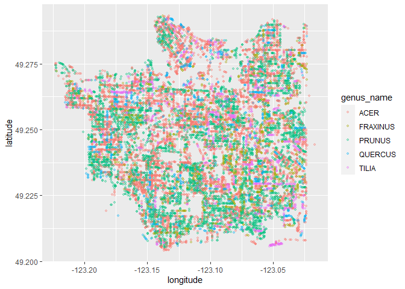

Mini Data-Analysis Deliverable 1
================

# Welcome to your (maybe) first-ever data analysis project!

And hopefully the first of many. Let’s get started:

1.  Install the [`datateachr`](https://github.com/UBC-MDS/datateachr)
    package by typing the following into your **R terminal**:

<!-- -->

    install.packages("devtools")
    devtools::install_github("UBC-MDS/datateachr")

2.  Load the packages below.

``` r
library(datateachr)
library(tidyverse)
```

    ## ── Attaching packages ─────────────────────────────────────── tidyverse 1.3.2 ──
    ## ✔ ggplot2 3.3.6      ✔ purrr   0.3.4 
    ## ✔ tibble  3.1.8      ✔ dplyr   1.0.10
    ## ✔ tidyr   1.2.1      ✔ stringr 1.4.1 
    ## ✔ readr   2.1.2      ✔ forcats 0.5.2 
    ## ── Conflicts ────────────────────────────────────────── tidyverse_conflicts() ──
    ## ✖ dplyr::filter() masks stats::filter()
    ## ✖ dplyr::lag()    masks stats::lag()

3.  Make a repository in the <https://github.com/stat545ubc-2022>
    Organization. You will be working with this repository for the
    entire data analysis project. You can either make it public, or make
    it private and add the TA’s and Lucy as collaborators. A link to
    help you create a private repository is available on the
    \#collaborative-project Slack channel.

# Instructions

## For Both Milestones

-   Each milestone is worth 45 points. The number of points allocated to
    each task will be annotated within each deliverable. Tasks that are
    more challenging will often be allocated more points.

-   10 points will be allocated to the reproducibility, cleanliness, and
    coherence of the overall analysis. While the two milestones will be
    submitted as independent deliverables, the analysis itself is a
    continuum - think of it as two chapters to a story. Each chapter, or
    in this case, portion of your analysis, should be easily followed
    through by someone unfamiliar with the content.
    [Here](https://swcarpentry.github.io/r-novice-inflammation/06-best-practices-R/)
    is a good resource for what constitutes “good code”. Learning good
    coding practices early in your career will save you hassle later on!

## For Milestone 1

**To complete this milestone**, edit [this very `.Rmd`
file](https://raw.githubusercontent.com/UBC-STAT/stat545.stat.ubc.ca/master/content/mini-project/mini-project-1.Rmd)
directly. Fill in the sections that are tagged with
`<!--- start your work below --->`.

**To submit this milestone**, make sure to knit this `.Rmd` file to an
`.md` file by changing the YAML output settings from
`output: html_document` to `output: github_document`. Commit and push
all of your work to the mini-analysis GitHub repository you made
earlier, and tag a release on GitHub. Then, submit a link to your tagged
release on canvas.

**Points**: This milestone is worth 45 points: 43 for your analysis, 1
point for having your Milestone 1 document knit error-free, and 1 point
for tagging your release on Github.

# Learning Objectives

By the end of this milestone, you should:

-   Become familiar with your dataset of choosing
-   Select 4 questions that you would like to answer with your data
-   Generate a reproducible and clear report using R Markdown
-   Become familiar with manipulating and summarizing your data in
    tibbles using `dplyr`, with a research question in mind.

# Task 1: Choose your favorite dataset (10 points)

The `datateachr` package by Hayley Boyce and Jordan Bourak currently
composed of 7 semi-tidy datasets for educational purposes. Here is a
brief description of each dataset:

-   *apt_buildings*: Acquired courtesy of The City of Toronto’s Open
    Data Portal. It currently has 3455 rows and 37 columns.

-   *building_permits*: Acquired courtesy of The City of Vancouver’s
    Open Data Portal. It currently has 20680 rows and 14 columns.

-   *cancer_sample*: Acquired courtesy of UCI Machine Learning
    Repository. It currently has 569 rows and 32 columns.

-   *flow_sample*: Acquired courtesy of The Government of Canada’s
    Historical Hydrometric Database. It currently has 218 rows and 7
    columns.

-   *parking_meters*: Acquired courtesy of The City of Vancouver’s Open
    Data Portal. It currently has 10032 rows and 22 columns.

-   *steam_games*: Acquired courtesy of Kaggle. It currently has 40833
    rows and 21 columns.

-   *vancouver_trees*: Acquired courtesy of The City of Vancouver’s Open
    Data Portal. It currently has 146611 rows and 20 columns.

**Things to keep in mind**

-   We hope that this project will serve as practice for carrying our
    your own *independent* data analysis. Remember to comment your code,
    be explicit about what you are doing, and write notes in this
    markdown document when you feel that context is required. As you
    advance in the project, prompts and hints to do this will be
    diminished - it’ll be up to you!

-   Before choosing a dataset, you should always keep in mind **your
    goal**, or in other ways, *what you wish to achieve with this data*.
    This mini data-analysis project focuses on *data wrangling*,
    *tidying*, and *visualization*. In short, it’s a way for you to get
    your feet wet with exploring data on your own.

And that is exactly the first thing that you will do!

1.1 Out of the 7 datasets available in the `datateachr` package, choose
**4** that appeal to you based on their description. Write your choices
below:

**Note**: We encourage you to use the ones in the `datateachr` package,
but if you have a dataset that you’d really like to use, you can include
it here. But, please check with a member of the teaching team to see
whether the dataset is of appropriate complexity. Also, include a
**brief** description of the dataset here to help the teaching team
understand your data.

<!-------------------------- Start your work below ---------------------------->

1: building_permits  
2: flow_sample  
3: steam_games  
4: vancouver_trees

<!----------------------------------------------------------------------------->

1.2 One way to narrowing down your selection is to *explore* the
datasets. Use your knowledge of dplyr to find out at least *3*
attributes about each of these datasets (an attribute is something such
as number of rows, variables, class type…). The goal here is to have an
idea of *what the data looks like*.

*Hint:* This is one of those times when you should think about the
cleanliness of your analysis. I added a single code chunk for you below,
but do you want to use more than one? Would you like to write more
comments outside of the code chunk?

<!-------------------------- Start your work below ---------------------------->

**1. building_permits**

``` r
glimpse(building_permits)
```

    ## Rows: 20,680
    ## Columns: 14
    ## $ permit_number               <chr> "BP-2016-02248", "BU468090", "DB-2016-0445…
    ## $ issue_date                  <date> 2017-02-01, 2017-02-01, 2017-02-01, 2017-…
    ## $ project_value               <dbl> 0, 0, 35000, 15000, 181178, 0, 15000, 0, 6…
    ## $ type_of_work                <chr> "Salvage and Abatement", "New Building", "…
    ## $ address                     <chr> "4378 W 9TH AVENUE, Vancouver, BC V6R 2C7"…
    ## $ project_description         <chr> NA, NA, NA, NA, NA, NA, NA, NA, NA, NA, NA…
    ## $ building_contractor         <chr> NA, NA, NA, "Mercury Contracting Ltd", "08…
    ## $ building_contractor_address <chr> NA, NA, NA, "88 W PENDER ST  \r\nUnit 2069…
    ## $ applicant                   <chr> "Raffaele & Associates DBA: Raffaele and A…
    ## $ applicant_address           <chr> "2642 East Hastings\r\nVancouver, BC  V5K …
    ## $ property_use                <chr> "Dwelling Uses", "Dwelling Uses", "Dwellin…
    ## $ specific_use_category       <chr> "One-Family Dwelling", "Multiple Dwelling"…
    ## $ year                        <dbl> 2017, 2017, 2017, 2017, 2017, 2017, 2017, …
    ## $ bi_id                       <dbl> 524, 535, 539, 541, 543, 546, 547, 548, 54…

There are 20680 rows and 14 columns in the dataset `building_permits`,
including:

-   permit_number
-   issue_date
-   project_value
-   type_of_work
-   address
-   project_description
-   building_contractor
-   building_contractor_address
-   applicant
-   applicant_address
-   property_use
-   specific_use_category
-   year
-   bi_id

And 3 different data types, including:

-   chr
-   date
-   dbl

**2. flow_sample**

``` r
glimpse(flow_sample)
```

    ## Rows: 218
    ## Columns: 7
    ## $ station_id   <chr> "05BB001", "05BB001", "05BB001", "05BB001", "05BB001", "0…
    ## $ year         <dbl> 1909, 1910, 1911, 1912, 1913, 1914, 1915, 1916, 1917, 191…
    ## $ extreme_type <chr> "maximum", "maximum", "maximum", "maximum", "maximum", "m…
    ## $ month        <dbl> 7, 6, 6, 8, 6, 6, 6, 6, 6, 6, 6, 7, 6, 6, 6, 7, 5, 7, 6, …
    ## $ day          <dbl> 7, 12, 14, 25, 11, 18, 27, 20, 17, 15, 22, 3, 9, 5, 14, 5…
    ## $ flow         <dbl> 314, 230, 264, 174, 232, 214, 236, 309, 174, 345, 185, 24…
    ## $ sym          <chr> NA, NA, NA, NA, NA, NA, NA, NA, NA, NA, NA, NA, NA, NA, N…

There are 218 rows and 7 columns in the dataset `flow_sample`,
including:

-   station_id
-   year
-   extreme_type
-   month
-   day
-   flow
-   sym

And 2 different data types, including:

-   chr
-   dbl

**3. steam_games**

``` r
glimpse(steam_games)
```

    ## Rows: 40,833
    ## Columns: 21
    ## $ id                       <dbl> 1, 2, 3, 4, 5, 6, 7, 8, 9, 10, 11, 12, 13, 14…
    ## $ url                      <chr> "https://store.steampowered.com/app/379720/DO…
    ## $ types                    <chr> "app", "app", "app", "app", "app", "bundle", …
    ## $ name                     <chr> "DOOM", "PLAYERUNKNOWN'S BATTLEGROUNDS", "BAT…
    ## $ desc_snippet             <chr> "Now includes all three premium DLC packs (Un…
    ## $ recent_reviews           <chr> "Very Positive,(554),- 89% of the 554 user re…
    ## $ all_reviews              <chr> "Very Positive,(42,550),- 92% of the 42,550 u…
    ## $ release_date             <chr> "May 12, 2016", "Dec 21, 2017", "Apr 24, 2018…
    ## $ developer                <chr> "id Software", "PUBG Corporation", "Harebrain…
    ## $ publisher                <chr> "Bethesda Softworks,Bethesda Softworks", "PUB…
    ## $ popular_tags             <chr> "FPS,Gore,Action,Demons,Shooter,First-Person,…
    ## $ game_details             <chr> "Single-player,Multi-player,Co-op,Steam Achie…
    ## $ languages                <chr> "English,French,Italian,German,Spanish - Spai…
    ## $ achievements             <dbl> 54, 37, 128, NA, NA, NA, 51, 55, 34, 43, 72, …
    ## $ genre                    <chr> "Action", "Action,Adventure,Massively Multipl…
    ## $ game_description         <chr> "About This Game Developed by id software, th…
    ## $ mature_content           <chr> NA, "Mature Content Description  The develope…
    ## $ minimum_requirements     <chr> "Minimum:,OS:,Windows 7/8.1/10 (64-bit versio…
    ## $ recommended_requirements <chr> "Recommended:,OS:,Windows 7/8.1/10 (64-bit ve…
    ## $ original_price           <dbl> 19.99, 29.99, 39.99, 44.99, 0.00, NA, 59.99, …
    ## $ discount_price           <dbl> 14.99, NA, NA, NA, NA, 35.18, 70.42, 17.58, N…

There are 40833 rows and 21 columns in the dataset `steam_games`,
including:

-   id
-   url
-   types
-   name
-   desc_snippet
-   recent_reviews
-   all_reviews
-   release_date
-   developer
-   publisher
-   popular_tags
-   game_details
-   languages
-   achievements
-   genre
-   game_description
-   mature_content
-   minimum_requirements
-   recommended_requirements
-   original_price
-   discount_price

And 2 different data types, including:

-   chr
-   dbl

**4. vancouver_trees**

``` r
glimpse(vancouver_trees)
```

    ## Rows: 146,611
    ## Columns: 20
    ## $ tree_id            <dbl> 149556, 149563, 149579, 149590, 149604, 149616, 149…
    ## $ civic_number       <dbl> 494, 450, 4994, 858, 5032, 585, 4909, 4925, 4969, 7…
    ## $ std_street         <chr> "W 58TH AV", "W 58TH AV", "WINDSOR ST", "E 39TH AV"…
    ## $ genus_name         <chr> "ULMUS", "ZELKOVA", "STYRAX", "FRAXINUS", "ACER", "…
    ## $ species_name       <chr> "AMERICANA", "SERRATA", "JAPONICA", "AMERICANA", "C…
    ## $ cultivar_name      <chr> "BRANDON", NA, NA, "AUTUMN APPLAUSE", NA, "CHANTICL…
    ## $ common_name        <chr> "BRANDON ELM", "JAPANESE ZELKOVA", "JAPANESE SNOWBE…
    ## $ assigned           <chr> "N", "N", "N", "Y", "N", "N", "N", "N", "N", "N", "…
    ## $ root_barrier       <chr> "N", "N", "N", "N", "N", "N", "N", "N", "N", "N", "…
    ## $ plant_area         <chr> "N", "N", "4", "4", "4", "B", "6", "6", "3", "3", "…
    ## $ on_street_block    <dbl> 400, 400, 4900, 800, 5000, 500, 4900, 4900, 4900, 7…
    ## $ on_street          <chr> "W 58TH AV", "W 58TH AV", "WINDSOR ST", "E 39TH AV"…
    ## $ neighbourhood_name <chr> "MARPOLE", "MARPOLE", "KENSINGTON-CEDAR COTTAGE", "…
    ## $ street_side_name   <chr> "EVEN", "EVEN", "EVEN", "EVEN", "EVEN", "ODD", "ODD…
    ## $ height_range_id    <dbl> 2, 4, 3, 4, 2, 2, 3, 3, 2, 2, 2, 5, 3, 2, 2, 2, 2, …
    ## $ diameter           <dbl> 10.00, 10.00, 4.00, 18.00, 9.00, 5.00, 15.00, 14.00…
    ## $ curb               <chr> "N", "N", "Y", "Y", "Y", "Y", "Y", "Y", "Y", "Y", "…
    ## $ date_planted       <date> 1999-01-13, 1996-05-31, 1993-11-22, 1996-04-29, 19…
    ## $ longitude          <dbl> -123.1161, -123.1147, -123.0846, -123.0870, -123.08…
    ## $ latitude           <dbl> 49.21776, 49.21776, 49.23938, 49.23469, 49.23894, 4…

There are 146611 rows and 20 columns in the dataset `vancouver_trees`,
including:

-   tree_id
-   civic_number
-   std_street
-   genus_name
-   species_name
-   cultivar_name
-   common_name
-   assigned
-   root_barrier
-   plant_area
-   on_street_block
-   on_street
-   neighbourhood_name
-   street_side_name
-   height_range_id
-   diameter
-   curb
-   date_planted
-   longitude
-   latitude

And 3 different data types, including:

-   chr
-   date
-   dbl

<!----------------------------------------------------------------------------->

1.3 Now that you’ve explored the 4 datasets that you were initially most
interested in, let’s narrow it down to 2. What lead you to choose these
2? Briefly explain your choices below, and feel free to include any code
in your explanation.

<!-------------------------- Start your work below ---------------------------->

``` r
flow_sample %>%
  select(everything()) %>%
  arrange(year)
```

    ## # A tibble: 218 × 7
    ##    station_id  year extreme_type month   day   flow sym  
    ##    <chr>      <dbl> <chr>        <dbl> <dbl>  <dbl> <chr>
    ##  1 05BB001     1909 maximum          7     7 314    <NA> 
    ##  2 05BB001     1909 minimum         NA    NA  NA    <NA> 
    ##  3 05BB001     1910 maximum          6    12 230    <NA> 
    ##  4 05BB001     1910 minimum         NA    NA  NA    <NA> 
    ##  5 05BB001     1911 maximum          6    14 264    <NA> 
    ##  6 05BB001     1911 minimum          2    27   5.75 <NA> 
    ##  7 05BB001     1912 maximum          8    25 174    <NA> 
    ##  8 05BB001     1912 minimum          3    14   5.8  <NA> 
    ##  9 05BB001     1913 maximum          6    11 232    <NA> 
    ## 10 05BB001     1913 minimum          3    18   6.12 B    
    ## # … with 208 more rows

From the above code, we can know that the `flow_sample` dataset records
the minimum and maximum flow in each year from 1909 to 2018 (except
2017). This dataset maybe a little bit simple to research because there
are few correlations between these columns.

``` r
sum(is.na(building_permits)) / (sum(is.na(building_permits)) + sum(!is.na(building_permits)))
```

    ## [1] 0.09116123

``` r
sum(is.na(steam_games)) / (sum(is.na(steam_games)) + sum(!is.na(steam_games)))
```

    ## [1] 0.2109627

``` r
sum(is.na(vancouver_trees)) / (sum(is.na(vancouver_trees)) + sum(!is.na(vancouver_trees)))
```

    ## [1] 0.0651844

From the above code, I try to explore the percentage of NA values in
each dataset and we can easily see that the NA values in `steam game` is
much higher than the others, which may affect my further exploration.

**Therefore, I would like to choose `building_permits` and
`vancouver_trees` datasets.**

<!----------------------------------------------------------------------------->

1.4 Time for the final decision! Going back to the beginning, it’s
important to have an *end goal* in mind. For example, if I had chosen
the `titanic` dataset for my project, I might’ve wanted to explore the
relationship between survival and other variables. Try to think of 1
research question that you would want to answer with each dataset. Note
them down below, and make your final choice based on what seems more
interesting to you!

<!-------------------------- Start your work below ---------------------------->

**Finally, I would like to choose `vancouver_trees` dataset for my
project. I want to explore the relationship between tree diameter,
height and other variables(such as genus, species, cultivar, root
barrier…)**

<!----------------------------------------------------------------------------->

# Important note

Read Tasks 2 and 3 *fully* before starting to complete either of them.
Probably also a good point to grab a coffee to get ready for the fun
part!

This project is semi-guided, but meant to be *independent*. For this
reason, you will complete tasks 2 and 3 below (under the **START HERE**
mark) as if you were writing your own exploratory data analysis report,
and this guidance never existed! Feel free to add a brief introduction
section to your project, format the document with markdown syntax as you
deem appropriate, and structure the analysis as you deem appropriate.
Remember, marks will be awarded for completion of the 4 tasks, but 10
points of the whole project are allocated to a reproducible and clean
analysis. If you feel lost, you can find a sample data analysis
[here](https://www.kaggle.com/headsortails/tidy-titarnic) to have a
better idea. However, bear in mind that it is **just an example** and
you will not be required to have that level of complexity in your
project.

# Task 2: Exploring your dataset (15 points)

If we rewind and go back to the learning objectives, you’ll see that by
the end of this deliverable, you should have formulated *4* research
questions about your data that you may want to answer during your
project. However, it may be handy to do some more exploration on your
dataset of choice before creating these questions - by looking at the
data, you may get more ideas. **Before you start this task, read all
instructions carefully until you reach START HERE under Task 3**.

2.1 Complete *4 out of the following 8 exercises* to dive deeper into
your data. All datasets are different and therefore, not all of these
tasks may make sense for your data - which is why you should only answer
*4*. Use *dplyr* and *ggplot*.

1.  Plot the distribution of a numeric variable.
2.  Create a new variable based on other variables in your data (only if
    it makes sense)
3.  Investigate how many missing values there are per variable. Can you
    find a way to plot this?
4.  Explore the relationship between 2 variables in a plot.
5.  Filter observations in your data according to your own criteria.
    Think of what you’d like to explore - again, if this was the
    `titanic` dataset, I may want to narrow my search down to passengers
    born in a particular year…
6.  Use a boxplot to look at the frequency of different observations
    within a single variable. You can do this for more than one variable
    if you wish!
7.  Make a new tibble with a subset of your data, with variables and
    observations that you are interested in exploring.
8.  Use a density plot to explore any of your variables (that are
    suitable for this type of plot).

2.2 For each of the 4 exercises that you complete, provide a *brief
explanation* of why you chose that exercise in relation to your data (in
other words, why does it make sense to do that?), and sufficient
comments for a reader to understand your reasoning and code.

<!-------------------------- Start your work below ---------------------------->

**Exercise 1**

I would like to know the distribution of tree diameter in the dataset
(corresponding to Q1).

``` r
answer1 <- ggplot(vancouver_trees, aes(x = diameter, y = ..density..)) +
   geom_density()

print(answer1)
```

<!-- -->

``` r
vancouver_trees %>%
  select(tree_id, diameter) %>%
  filter(diameter > 100)
```

    ## # A tibble: 10 × 2
    ##    tree_id diameter
    ##      <dbl>    <dbl>
    ##  1  182674      144
    ##  2  184211      305
    ##  3   23759      141
    ##  4   51001      182
    ##  5   84751      161
    ##  6  199599      435
    ##  7  117345      131
    ##  8   54498      156
    ##  9   78588      151
    ## 10  149285      317

From the above graph, we can know that most trees’ diameter are less
than 100 and there are only 10 trees with diameter over 100.

**Exercise 2**

Next, I created a new variable `location` to combine longitude and
latitude columns (corresponding to Q2), which makes the tree location
clear.

``` r
vancouver_trees %>%
  unite(col = location, c(longitude, latitude), sep = ", ") %>%
  select(tree_id, location)
```

    ## # A tibble: 146,611 × 2
    ##    tree_id location              
    ##      <dbl> <chr>                 
    ##  1  149556 -123.116113, 49.217763
    ##  2  149563 -123.114718, 49.217759
    ##  3  149579 -123.084553, 49.239375
    ##  4  149590 -123.086986, 49.234688
    ##  5  149604 -123.084565, 49.238944
    ##  6  149616 -123.119589, 49.215133
    ##  7  149617 -123.081328, 49.239975
    ##  8  149618 -123.081331, 49.239725
    ##  9  149619 -123.081341, 49.239511
    ## 10  149625 -123.089727, 49.234721
    ## # … with 146,601 more rows

**Exercise 3**

I try to find the missing values in each variable and plot them
(corresponding to Q3).

``` r
na_count <- vancouver_trees %>%
  summarise(across(everything(), function(x) sum(length(which(is.na(x)))))) %>%
  pivot_longer(cols = everything(), names_to = 'columns') 

print(na_count)
```

    ## # A tibble: 20 × 2
    ##    columns            value
    ##    <chr>              <int>
    ##  1 tree_id                0
    ##  2 civic_number           0
    ##  3 std_street             0
    ##  4 genus_name             0
    ##  5 species_name           0
    ##  6 cultivar_name      67559
    ##  7 common_name            0
    ##  8 assigned               0
    ##  9 root_barrier           0
    ## 10 plant_area          1486
    ## 11 on_street_block        0
    ## 12 on_street              0
    ## 13 neighbourhood_name     0
    ## 14 street_side_name       0
    ## 15 height_range_id        0
    ## 16 diameter               0
    ## 17 curb                   0
    ## 18 date_planted       76548
    ## 19 longitude          22771
    ## 20 latitude           22771

``` r
ggplot(na_count, aes(value, columns)) + geom_col()
```

<!-- -->

From the table and plot, we can see that there are 5 columns containing
NA values, which are `plant_area`(1486), `longitude`(22771),
`latitude`(22771), `date_planted`(76548), `cultivar_name`(67559).

**Exercise 4**

I want to make a new tibble with a subset of my data (corresponding to
Q7), with `tree_id`, `diameter`, `height_range_id`, `genus_name`,
`species_name`, `cultivar_name`, `common_name` and filter all
`root_barrier='Y'` observations to further explore the relationship
between these variables.

``` r
subset_vancouver_trees <- vancouver_trees %>%
  select(tree_id, diameter, height_range_id, genus_name, species_name, cultivar_name, common_name,root_barrier) %>%
  filter(root_barrier == 'N')

print(subset_vancouver_trees)
```

    ## # A tibble: 137,455 × 8
    ##    tree_id diameter height_range_id genus_name species…¹ culti…² commo…³ root_…⁴
    ##      <dbl>    <dbl>           <dbl> <chr>      <chr>     <chr>   <chr>   <chr>  
    ##  1  149556     10                 2 ULMUS      AMERICANA BRANDON BRANDO… N      
    ##  2  149563     10                 4 ZELKOVA    SERRATA   <NA>    JAPANE… N      
    ##  3  149579      4                 3 STYRAX     JAPONICA  <NA>    JAPANE… N      
    ##  4  149590     18                 4 FRAXINUS   AMERICANA AUTUMN… AUTUMN… N      
    ##  5  149604      9                 2 ACER       CAMPESTRE <NA>    HEDGE … N      
    ##  6  149616      5                 2 PYRUS      CALLERYA… CHANTI… CHANTI… N      
    ##  7  149617     15                 3 ACER       PLATANOI… COLUMN… COLUMN… N      
    ##  8  149618     14                 3 ACER       PLATANOI… COLUMN… COLUMN… N      
    ##  9  149619     16                 2 ACER       PLATANOI… COLUMN… COLUMN… N      
    ## 10  149625      7.5               2 FRAXINUS   AMERICANA AUTUMN… AUTUMN… N      
    ## # … with 137,445 more rows, and abbreviated variable names ¹​species_name,
    ## #   ²​cultivar_name, ³​common_name, ⁴​root_barrier

<!----------------------------------------------------------------------------->

# Task 3: Write your research questions (5 points)

So far, you have chosen a dataset and gotten familiar with it through
exploring the data. Now it’s time to figure out 4 research questions
that you would like to answer with your data! Write the 4 questions and
any additional comments at the end of this deliverable. These questions
are not necessarily set in stone - TAs will review them and give you
feedback; therefore, you may choose to pursue them as they are for the
rest of the project, or make modifications!

<!--- *****START HERE***** --->

**Question 1**

> Is root barrier affecting the diameter of trees?

**Question 2**

> What is the most popular tree genus for each neighourhood?

**Question 3**

> What is the relationship between tree diameter and date_plant? Is it
> possible to predict tree diameter based on the variables like
> date_plant, genus, species?

**Question 4**

> Based on the given tree’s location, can we visualize the trees’ map
> and apply clustering algorithms to find out the clusters of each
> genus?

# Task 4: Process and summarize your data (13 points)

From Task 2, you should have an idea of the basic structure of your
dataset (e.g. number of rows and columns, class types, etc.). Here, we
will start investigating your data more in-depth using various data
manipulation functions.

### 1.1 (10 points)

Now, for each of your four research questions, choose one task from
options 1-4 (summarizing), and one other task from 4-8 (graphing). You
should have 2 tasks done for each research question (8 total). Make sure
it makes sense to do them! (e.g. don’t use a numerical variables for a
task that needs a categorical variable.). Comment on why each task helps
(or doesn’t!) answer the corresponding research question.

Ensure that the output of each operation is printed!

**Summarizing:**

1.  Compute the *range*, *mean*, and *two other summary statistics* of
    **one numerical variable** across the groups of **one categorical
    variable** from your data.
2.  Compute the number of observations for at least one of your
    categorical variables. Do not use the function `table()`!
3.  Create a categorical variable with 3 or more groups from an existing
    numerical variable. You can use this new variable in the other
    tasks! *An example: age in years into “child, teen, adult, senior”.*
4.  Based on two categorical variables, calculate two summary statistics
    of your choosing.

**Graphing:**

5.  Create a graph out of summarized variables that has at least two
    geom layers.
6.  Create a graph of your choosing, make one of the axes logarithmic,
    and format the axes labels so that they are “pretty” or easier to
    read.
7.  Make a graph where it makes sense to customize the alpha
    transparency.
8.  Create 3 histograms out of summarized variables, with each histogram
    having different sized bins. Pick the “best” one and explain why it
    is the best.

Make sure it’s clear what research question you are doing each operation
for!

<!------------------------- Start your work below ----------------------------->

**Research question 1**

> Is root barrier affecting the diameter of trees?

**Summarizing:**

I compute the *range*, *mean*, *median*, and *variance* of `diameter`
across the groups of `root_barrier` from the dataset and use the *mean*
value to plot.

``` r
statistics_vancouver_trees <- vancouver_trees %>%
  select(diameter, root_barrier) %>%
  group_by(root_barrier) %>%
  summarise(range =  max(diameter) - min(diameter), mean = mean(diameter),  median = median(diameter), variance = var(diameter))

print(statistics_vancouver_trees)
```

    ## # A tibble: 2 × 5
    ##   root_barrier range  mean median variance
    ##   <chr>        <dbl> <dbl>  <dbl>    <dbl>
    ## 1 N            435   12.0      10    86.3 
    ## 2 Y             85.5  4.40      3     8.99

**Graphing:**

Based on summarizing result, this graph with two geom layers shows the
*mean* of `diameter` for the trees installed Root barrier or not.

``` r
ggplot(statistics_vancouver_trees, aes(root_barrier, mean)) + 
    geom_col() +
    geom_text(aes(label = mean), nudge_y = 0.5)
```

<!-- -->

**Research question 2**

> Which neighourhood has the most different genus of trees?

**Summarizing:**

I compute the number of observations for `genus` and `neighbourhood`
variables.

``` r
genus_neighbourhood_vancouver_trees <- vancouver_trees %>%
  select(neighbourhood_name, genus_name) %>%
  group_by(neighbourhood_name, genus_name) %>%
  count()

print(genus_neighbourhood_vancouver_trees)
```

    ## # A tibble: 1,303 × 3
    ## # Groups:   neighbourhood_name, genus_name [1,303]
    ##    neighbourhood_name genus_name      n
    ##    <chr>              <chr>       <int>
    ##  1 ARBUTUS-RIDGE      ABIES          18
    ##  2 ARBUTUS-RIDGE      ACER          867
    ##  3 ARBUTUS-RIDGE      AESCULUS      134
    ##  4 ARBUTUS-RIDGE      AMELANCHIER    19
    ##  5 ARBUTUS-RIDGE      BETULA         77
    ##  6 ARBUTUS-RIDGE      CALOCEDRUS      1
    ##  7 ARBUTUS-RIDGE      CARPINUS      167
    ##  8 ARBUTUS-RIDGE      CATALPA         5
    ##  9 ARBUTUS-RIDGE      CEDRUS         11
    ## 10 ARBUTUS-RIDGE      CELTIS          4
    ## # … with 1,293 more rows

**Graphing:**

Based on summarizing result, I further compute the number of different
tree genus in each neighbourhood and plot them with two geom layers.

``` r
genus_neighbourhood_vancouver_trees %>%
  select(neighbourhood_name, genus_name) %>%
  distinct() %>%
  group_by(neighbourhood_name) %>%
  count() %>%
  ggplot(aes(neighbourhood_name, n)) + 
    geom_col() +
    geom_text(aes(label = n), nudge_y = 2) +
    coord_flip()
```

<!-- -->

**Research question 3**

> What is the relationship between tree diameter and date_plant? Is it
> possible to predict tree diameter based on the variables like
> date_plant, genus, species?

**Summarizing:**

I create a categorical variable `classfied_diameter` with 4 groups from
`diameter` variable.

1.  0 \< diameter \< 5: small
2.  5 \<= diameter \< 10: middle
3.  10 \<= diameter \< 20: large
4.  diameter \>= 20: huge

After classifying, there are 26187, 43379, 30530, and 46515 observations
respectively.

``` r
classified_vancouver_trees <- vancouver_trees %>%
  select(tree_id, diameter) %>%
  mutate(classfied_diameter = NA)

classified_vancouver_trees$classfied_diameter <- as.factor(ifelse(classified_vancouver_trees$diameter<5, 'small', ifelse(classified_vancouver_trees$diameter<10, 'middle',ifelse(classified_vancouver_trees$diameter<20, 'large', ifelse(classified_vancouver_trees$diameter>=20, 'huge', NA)))))

classified_vancouver_trees %>%
  group_by(classfied_diameter) %>%
  count()
```

    ## # A tibble: 4 × 2
    ## # Groups:   classfied_diameter [4]
    ##   classfied_diameter     n
    ##   <fct>              <int>
    ## 1 huge               26187
    ## 2 large              43379
    ## 3 middle             30530
    ## 4 small              46515

**Graphing:**

I create a graph to explore the relationship between `diameter` and
`date_planted`, For pretty and easier reading, I make `y = diameter`
logarithmic.

``` r
vancouver_trees %>%
  ggplot(aes(date_planted, diameter)) +
  geom_point(alpha = 0.03, size = 1) +
  scale_y_log10("diameter") +
  theme_bw() +
  xlab("date_planted")
```

<!-- -->

**Research question 4**

> Based on the locations of all trees, can we visualize the trees’ map
> and apply clustering algorithms to find out the clusters of each
> genus?

**Summarizing:**

I compute the number of observations for `genus` and sort them. Then I
try to find out the top 5 number of tree genus and plot them.

``` r
vancouver_trees %>%
  select(genus_name) %>%
  group_by(genus_name) %>%
  count() %>%
  arrange(desc(n))
```

    ## # A tibble: 97 × 2
    ## # Groups:   genus_name [97]
    ##    genus_name     n
    ##    <chr>      <int>
    ##  1 ACER       36062
    ##  2 PRUNUS     30683
    ##  3 FRAXINUS    7381
    ##  4 TILIA       6773
    ##  5 QUERCUS     6119
    ##  6 CARPINUS    5806
    ##  7 FAGUS       4808
    ##  8 MALUS       4173
    ##  9 MAGNOLIA    3899
    ## 10 CRATAEGUS   3864
    ## # … with 87 more rows

**Graphing:**

Based on the summarizing result, I decide to make a graph to plot the
distribution of *ACER*, *PRUNUS*, *FRAXINUS*, *TILIA*, *QUERCUS* trees
based on their location (longitude and latitude). Customized alpha
transparency is used because there are lots of overlapping points in the
graph. The alpha transparency makes it easy for readers to identify
which genus these points are belonging to.

``` r
vancouver_trees %>%
  filter(genus_name == c("ACER", "PRUNUS", "FRAXINUS", "TILIA", "QUERCUS")) %>%
  ggplot(aes(x = longitude, y = latitude, color = genus_name)) +
  geom_point(alpha = 0.3, size = 0.9)
```

<!-- -->

<!----------------------------------------------------------------------------->

### 1.2 (3 points)

Based on the operations that you’ve completed, how much closer are you
to answering your research questions? Think about what aspects of your
research questions remain unclear. Can your research questions be
refined, now that you’ve investigated your data a bit more? Which
research questions are yielding interesting results?

<!-------------------------- Start your work below ---------------------------->

**Research question 1:**

> Is root barrier affecting the diameter of trees?

The operations finished in task 3 have already answered my research
question 1.

From the summary statistics and graph, I already knew that the root
barrier will significantly affect the diameter of trees because the mean
and median diameter for root-barrier installed trees are much less than
the uninstalled ones.

**Research question 2:**

> Which neighourhood has the most different genus of trees?

The operations finished in task 3 have already answered my research
question 2.

From the column graph, I can clearly see that the neighourhood
*KITSILANO* has the most different genus of trees, which is 73.

**Research question 3**

> What is the relationship between tree diameter and date_plant? Is it
> possible to predict tree diameter based on the variables like
> date_plant, genus, species?

The operations finished in task 3 have partially answered my research
question 3.

From the scatter graph I generated, we can see that the tree with
earlier planted date tends to have larger diameter. However, predicting
tree diameter should consider more variables, and data mining algorithms
should be applied.

**Research question 4**

> Based on the locations of all trees, can we visualize the trees’ map
> and apply clustering algorithms to find out the clusters of each
> genus?

The operations finished in task 3 have partially answered my research
question 4.

Based on the longitude and latitude, I visualize the trees’ map for the
5 most popular genus trees. Because there are lots of overlapping
between these points, alpha transparency is applied to make them clear.

To be mentioned that some genus of tree distributions are quite
dispersed that it is difficult (or meaningless) to find the clusters of
them. Therefore, I would like to apply clustering algorithms only on
particular tree genus with obvious clusters.

<!----------------------------------------------------------------------------->

### Attribution

Thanks to Icíar Fernández Boyano for mostly putting this together, and
Vincenzo Coia for launching.
